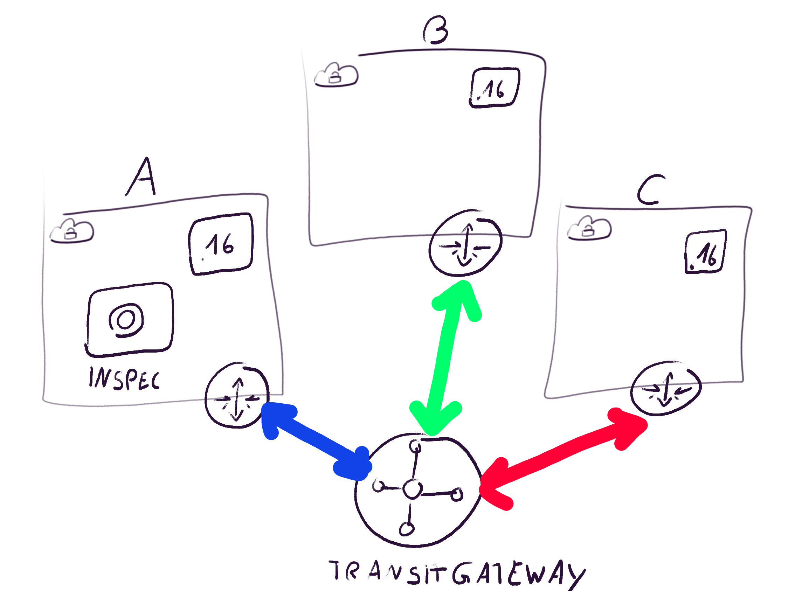

# Demo for Transit Gateway

This is a Transit Gateway demomstration for demonstration and training purposes.

Questions to G.Glawe gglawe@tecracer.de

This demonstration has three parts:

1) Automatic testing of  CloudFormation stacks with taskCat
    Used for the VPCs and EC2 instances
2) Automatic testing of Webserver accessibility with **inspec**
    User for thesting of Transit Gateway
3) Manually create Transit Gateway
   And test configuration with **inspec**

See for german Introduction: [Blog](http://www.aws-blog.de/2018/12/20/mit-allen-verbunden-test-transit-gateway-mit-cloudformation-taskcat-teil-1-und-kitchen-inspec-teil-2/)

This is only configured for regions eu-west-1 and eu-central-1. But you should easily be able to update it to use other regions.

## What does it do?

This demo creates three VPCs with EC2 instances in it via cloudformation. The CloudFormation is tested with taskCat. On each instance a webserver runs on port 80. The security group opens them to port 80.



## Configuration

You need [taskCat](https://aws-quickstart.github.io/taskcat/).

Then install [clouds-aws](https://github.com/elias5000/clouds-aws).

For part 2/3 you nedd to install the [ChefDK](https://downloads.chef.io/chefdk)

I assume you have a bash and make installed.
This is tested on a mac and should run on linux also.

Also you need proper AWS credentials configured.

And you have to have an EC2 ssh key called "default-lab-key" in your region of choice. If the name differs, you can change it in the `stacks/demo*/parameters.yaml`. The key is used to spin up the instances. For the demo you do not have to ssh into the instances, but you might want to run some additional tests from within the instances.

## Execute Tests

1) `make lint-cfn`
  
    Lint the CloudFormation. Takes about 2 seconds.

2) `make test-cfn`
  
    taskCat deploys the templates. You may want to watch the AWS CloudFormation console to see the stacks got build and deleted.
    Watch log for messages, maybe you have to clean up a stack for yourself.
    Look out for VPC limits, because 3 of them are created. This takes about 5 minutes.

3) `make report-cfn-test`
  
    Shows test reports

4) `make deploy`

   Creates the three vpcs in the current region (set region in the Makefile). Takes also about 5 minutes.

5) `make describe`

    Gets the resources from vpc-a.
    Note `PhysicalId` from  `PublicSubnet1`.

6) Edit `.kitchen.yml`

    Set `region` (platforms:driver:region) to same region from Makefile.

    Set `image_id` (platforms:driver:image_id) to same image used in template.
    In template `stacks/demo-vpc-a/template.yaml` in section `Mappings` you see the AMIs per region.

    Set `subnet_id` (platforms:driver:subnet_id):
    Replace id with noted id from previous step.


7)  `eval "$(chef shell-init bash)"`

    Init Chef. This command sets the Chef Ruby as ruby environment and some other stuff.


8) `make start-kitchen`

    Starts the kitchen test instance in VPC Demo_A. Takes about 1 minute.

    If the instance is not created check:
    - image_id in .kitchen.yml
    - subnet_id in .kitchen.yml
    - try `kitchen destroy` to destroy previos instances
    - try deleting subdir `.kitchen` and retry

9) `make test-kitchen`

    This will run the tests, defined in `test/integration/default`.
    You will see, that only the one test is ok.
    ```bash 
      http GET on http://10.0.1.16
     ✔  status should cmp == 200
     ✔  body should eq "Node A"
      http GET on http://10.0.2.16
     ×  status should cmp == 200
     ```

10) Create a transit Gateway to connect the VPCs

    * Create Transit Gateway with the console Menu (EC2-Transit-Gateways-Transit-Gateway), Button "Create Transit Gateway"
     * Fill out Name (e.g. DemoTG) and description
     * Leave all other fields blank
     * This takes about one minute

11) `make test-kitchen` again

    Nothing changes yet, only one test ok

12) Create Transit-Gateway-Attachment VPC A

    * Choose newly created Transit Gateway in "Transit Gateway ID"
    * Leave "Attachment Type" at VPC
    * "Demo VPC A" as "Attachment name tag"
    * Choose "VPC Demo_A" as "VPC ID"
    * Create Attachment

13) Create Transit-Gateway-Attachment VPC B

    * Repeat steps from last step with VPC B

14) `make test-kitchen` again

    Nothing changes yet, only one test ok.
    This is because the routes from the vpcs back to the Transit Gateway are missing.

15) Create Route back to Transit Gateway for Subnet in VPC A
    * Goto Console VPC
    * Click Subnets
    * Choose "Demo_A Public Subnet a
    * Click Route Table tab 
    * Click on Route Table to get to the Table
    * Click tab "Routes" in the route table
    * Edit Routes
    * Add Route 
      * Destination: "10.0.0.0/16"
      * Target: Created Target Gateway ID 
  
16) `make test-kitchen` again

    Nothing changes yet, only one test ok.
    This is because the routes from the vpc B back to the Transit Gateway is missing.
 
17) Create Route back to Transit Gateway for subnet in VPC B
    Same as VPCa

18) `make test-kitchen` again

    Now more test are working:
    ```bash
      http GET on http://10.0.1.16
     ✔  status should cmp == 200
     ✔  body should eq "Node A"
      http GET on http://10.0.2.16
     ✔  status should cmp == 200
    ```

Congratiolation, you have tested CloudFormation and Routing for connecting two VPCs with Transit Gateway.

## Cleanup

Don`t forget to clean up, cause some resources cost money.

1) Delete Transit Gateway Attachments one by one
2) Delete Transit Gateway 
3) `make delete-kitchen`
    Destroy Kitchen test instance
4) `make delete`
    This deletes the stacks with the VPCs and Instances